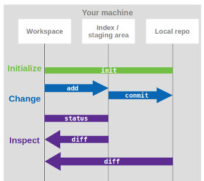

# Basic local Git Workflow

!!! note "Objectives📍"

    - init
    - add
    - commit
    - status
    - diff
    - log


**Note:** For this tutorial you will need a project folder to work on. 

Now that we have a basic understanding of what Git is and what it does, we want to try it. In this section we want to make changes to our project and therefore create different versions of our project. To do so, we first need to learn the basic vocabulary of Git. 

!!! tip "Git vocabulary"

    - `git init`: to give git initial control over your files
    - `git add`: adds a change from the working directory into the staging area
    - `git commit`: saves a snapshot of the current version of your project in the repository
    - `git status`: check the status of the files
    - `git diff`: let’s you inspect differences between versions (in a certain way)
    - `git log`: to view the commit history


## First steps

The very first step at the beginning of version controlling your files is to tell git to draw attention to this folder. With `git init` we give git the power to track our files. 

Navigate to your project folder in your command line/ terminal. You can also use [VSCode](https://code.visualstudio.com/download) as an IDE to work on your project. There you have an integrated terminal and are always in the folder which you currently have open in VSCode.

When you are in the right directory, type:

```
git init 
```

!!! tip "git init" 

     

However, our files are not tracked yet, for this we have to add and commit the files with a first commit. We can check this by typing 

```
git status
```

!!! tip "git status"

    Through the power we gave git by doing a `git init`, git always knows exactly what's going on in our folder. `git status` will tell us what that is. When using git only locally, we can have three different outputs of `git status`:

    - *untracked files*: git knows there are files in our folder but we didn't tell git to actually track them. Either we created a new file and haven' added it yet or we simply don't want this file to be tracked. 
    - *changes not staged for commit*: at some point we added this file and git tracks its status. Now we made changes to this file but we haven't added them, yet.
    - *changes to be committed*: these changes we already added to the staging area and will be included in our next commit. 

Let's move on. Because we want EVERYTHING in our folder be tracked by git, we simply add and commit everything at once. First we type

```
git add .
```

!!! tip "git add"

    Like we learned in the previous section, `git add` allows us to add files individually to the staging area. With the `git add .` we added ALL files to the staging area (that's what the `.` does after add). If you want to stage your files individually, you simply exchange the `.` with the name of the file you want to stage.


Now that we have all our files staged and waiting for the train to version database, we can commit them. We type

```
git commit
```

and our text editor opens automatically. This is because with every commit we need to write a commit message to know later what this commit was about. 

??? tip "The nano and vim text editors" 

    In case you configured nano or vim as your default text editor when using git (vim is the default editor on MaRC3a/JupyterHub): Those text editors are command-line editors which means they open directly in the terminal (no new window opens). With everything, you just need to know how to operate it:

    **nano**:<br>
    - when the editor opens for the commit message, you need to first press `enter` one time to make new line at the top. <br>
    - when you've done writing your commit message, you need to save and close it: `CTRL X` closes it but it asks you first if you want to save it by typing a capital `Y`, then `Enter`.<br>

    **vim**:<br>
    - when the editor opens you first need to type `i` to change from command mode to insert mode<br>
    - make a new line at the top by pressing `Enter`<br>
    - write your commit message and then press `Esc` and then `:wq` to save and exit<br>


!!! tip "Commit message structure"

    When the text editor opens and asks us for a commit message we have to insert a title and the actual commit message. The first line we write will be the title. The title should be short and expressive. Then we make an empty line and after this we write a longer commit message. This message can be as long as you wish or need it to be.

Because this is our first commit we can simply write a commit message like 
>"initial commit"
> 
>"added all my files of the choice_rtt project to be tracked by git"

Later, we need to be more specific when describing what we changed.

**NOTE FOR MAC USERS:** Please make sure your text editor really saves files in `.txt` and not `.rtf`. 

!!! tip "Please make sure that your text editor is really closed!!!"

## Making changes

Now we want to explore a bit the different functions of git. For this we need to make our first change. Open one of your files and make a change. Afterwards, type `git status` again. What does it say now?

So, we need to stage our change before we can commit it. We type 

```
git add *path-to-your-file*
```

because we only want this file to be committed. Why? Because a commit message is bound to the changes we commit and we want to write a useful commit message that says what we changed. We will see later why this is important. Now, commit your change and give it a useful commit message. 

```
git commit 
```

!!! tip "git commit"

    When you do a git commit, you don't need to specify which file you are committing as every file in the staging area will be committed. If you don't want certain files to be committed together, you need to specify this by your add-commit workflow. Every time you do a `git add`, a file comes into the staging area and is included in the next commit. 

    **Example**:

    You made changes on file1, file2, and file3. An add-commit workflow like this<br>
    `git add file1`<br>
    `git add file2`<br>
    `git commit`<br>
    `git add file3`<br>
    `git commit`<br>
    leads to file1 and file2 committed together, file3 separately.

    Whereas an add-commit workflow like this<br>
    `git add file1`<br>
    `git add file2`<br>
    `git add file3`<br>
    `git commit`<br>
    leads to all three files being committed together.

Again, our text editor opens and asks us for our commit message, so we should do that. 

When we do a `git status` again now, it should tells us 

>"nothing to commit, working tree clean"

which basically means that the version in our working directory is the exact same version as the *last* committed version (remember the structure of the git repository from the previous section). 

!!! question "Task 1" 

    1) Make a change to one of your files. Add and commit it like we just did.

    2) Make another change. Don't add it. 

    3) Create a new file and write something in it.

    4) Do a `git status`. What does it say? Do what it says needs to be done to get a clean working tree. Try the tip "git commit -m" below for committing. 


??? tip "git commit -m" 

    If you type `git commit -m` instead of `git commit`, git expects you to write a very short commit message after the `m`, like `git commit -m "my commit message"`. This short commit message basically replaces the title+message form and the commit message should be short and precise. You do not have more information to this commit than the short commit message. You should always think about when to make a short commit message and when you might need a longer explanation on what you've changed.  


## Looking at differences

Another great thing of git, besides storing different versions for us, is its ability to show us exactly what we changed. For this we have an extra command called `git diff`. Let`s try this.

Make another change to your file, close it, but DON'T commit it for now. We can now look at the difference between the version in our working directory and the one in our version database (= last committed version). Let's type a `git diff`. The output looks weird but is actually really helpful, here's an example of a git diff with an explanation below[^1]:

```
diff --git a/diff_test.txt b/diff_test.txt
index 6b0c6cf..b37e70a 100644
--- a/diff_test.txt
+++ b/diff_test.txt
@@ -1 +1 @@
-this is a git diff test example
+this is a diff example
```

- the first line just tells us which file is being compared. If you included multiple files in your commit, the differences for each file will be shown individually. So after all the differences for one file, the differences shown for another file start with this line `diff --git name-of-the-file` again.
- `index` shows us the hashes of the files being compared. You're right, we didn't commit our current version so it shouldn't have commit hash, yet. Well, git assigns a hash to it anyway but it's not really a commit hash but you can think of it more like a "working directory hash". 
- the third number after `index` tells us which kind of file it is. `100644` for example stands for an ordinary text file. 
- `--- a/filename` and `+++ b/filename`: changes from `a/diff_test.txt` are marked with a `---` and the changes from `b/diff_test.txt` are marked with the `+++` symbol
- The remaining diff output is a list of diff 'chunks'. A diff only displays the sections of the file that have changes. In our current example, we only have one chunk as we are working with a simple scenario. Chunks have their own granular output semantics
- The first line is the chunk header. Each chunk is prepended by a header enclosed within `@@` symbols. The content of the header is a summary of changes made to the file. In our simplified example, we have -1 +1 meaning line one had changes 
- In a more realistic diff, you would see a header like `@@ -34,6 +34,8 @@`: In this header example, 6 lines have been extracted starting from line number 34. Additionally, 8 lines have been added starting at line number 34
- The remaining content of the diff chunk displays the recent changes. Each changed line is prepended with a + or - symbol indicating which version of the diff input the changes come from

!!! tip "git diff"

    By simply typing `git diff` you will be shown the difference between the current version in the working directory and the last committed version. However, we can also look at differences between two committed versions or the difference to a staged version. For this we need the assigned commit hashes, which we can find out through a `git log`.


## The commit history

`git log` will show you your commit history. Your commit history is basically a list of all your commits annotated with metadata. One of the `git log` metadata are the commit hashes which you will need to search for/ go back to older versions or creating new branches (which we will learn in a sec). To see your commit history, simply type `git log`. Here's an example and explanation of what we see:

```
commit 211a87947765cb34fe922bb39eed8e2357ea5ae9 (HEAD -> main)
Author: julia-pfarr <pfarr@staff.uni-marburg.de>
Date:   Thu Feb 8 18:57:23 2024 +0100

    change Git intro
```

- The first line is the commit hash. That's a unique identifier for this commit
- The next two lines are author and date. If you start working collaboratively on a project, you will also see entries from your collaborators
- the next line is the title you gave your commit. If you put in a longer commit message, you would also see this longer commit message.
- `(HEAD -> main)`: `HEAD` is a symbolic reference pointing to wherever you are in your commit history. When you move in your commit history, `HEAD` moves with you, like a shadow. In our example, `HEAD` is with the latest commit and is *pointing* to `main`. This means we are on the latest commit that was made on the *branch* `main`. We will learn in the next section why having the `HEAD` reference is very useful. 

!!! tip "git log" 

    - to exit `git log`, press `q`
    - to only show a concentrated version of the commit history, type `git log --oneline`. It will only have the last 7 digits of the commit hash (which is all you need), the title of the commit, and the `HEAD` and `main`info, like this:

        ```
        211a879 (HEAD -> main) change Git intro
        c3c16d6 finish intro
        e4a1e75 add online experiment section to psychopy
        8644c34 add graphics to PsychoPy dir for testing
        7506aa6 delete Remote WSL extension
        541c70c reset
        0ec1af7 fix image path in psychopy intro
        ```


!!! question "Task 2"

    Do a `git diff` between your second commit and your second to last commit.

    ??? tip "Answer"

        - `git log --oneline` to find the commit hashes assigned to the respective commits
        - `git diff HASH_OLDER_COMMIT HASH_NEWER_COMMIT`


Here`s an overview on what we did so far[^2]:



### Git and binary files

Git is not good at handling binary files. You can still track them using git by adding and comitting them but git can't do a `git diff` of binary files. The reason is that git actually *reads* the files, thus it needs file formats that are text based (like usual code file types such as .py, .m, .R, or text files like .txt, .md, or tables in .csv, .tsv). File types like .docx, .xlsx, .pdf or images like .png, jpeg and so on are binary files which means the content of the files is actually stored in 0s and 1s. Therefore, `git diff` is not really working. There are some options how you can still diff binary files with git (see [this entry](https://www.atlassian.com/git/tutorials/saving-changes/git-diff) "diffing binary files") but it is just easier not to. 

If you have a lot of binary files and large files in your project you might want to think about excluding those files from the diff operations of git and also checking them into Git LFS instead. Because git checks all files every time and needs to come to the conclusion every time that this particular files is binary. Sometimes this can go wrong and git could possibly destroy your binary file. To avoid this you can create a `.gitattributes` files (the `.` before the file name is important!!) and tell git to track those files with Git LFS instead. 

!!! question "Task 3a"

    Create a `.gitattributes` files on the first level in your project folder:

    1) make new file `.gitattributes`.<br>
    2) put the following content:

            ```
            # Source files
            # ============
            *.pxd    text diff=python
            *.py     text diff=python
            *.py3    text diff=python
            *.pyw    text diff=python
            *.pyx    text diff=python
            *.pyz    text diff=python
            *.pyi    text diff=python

            # Binary files
            # ============
            *.db     binary
            *.p      binary
            *.pkl    binary
            *.pickle binary
            *.pyc    binary export-ignore
            *.pyo    binary export-ignore
            *.pyd    binary

            # Jupyter notebook
            *.ipynb  text eol=lf

            # Graphics: when git-lfs activated, exchange 'binary' with: filter=lfs diff=lfs merge=lfs -text
            *.png      binary 
            *.jpg      binary
            *.jpeg     binary
            *.gif      binary
            *.tif      binary
            *.tiff     binary
            *.ico      binary
            # SVG treated as text by default.
            *.svg      text
            # If you want to treat it as binary,
            # use the following line instead.
            # *.svg    binary
            *.eps      binary

            # Documents
            *.bibtex   text diff=bibtex
            *.doc      binary
            *.DOC      binary
            *.docx     binary
            *.DOCX     binary
            *.dot      binary
            *.DOT      binary
            *.pdf      binary
            *.PDF      binary
            *.rtf      diff=astextplain
            *.RTF      diff=astextplain
            *.md       text diff=markdown
            *.mdx      text diff=markdown
            *.tex      text diff=tex
            *.adoc     text
            *.textile  text
            *.mustache text
            *.csv      text eol=crlf
            *.tab      text
            *.tsv      text
            *.txt      text
            *.sql      text
            *.epub     diff=astextplain

!!! question "Task 3b"

    1) Check that you actually installed Git LFS: `git lfs --version`.<br>
    2) Git LFS has to be initialized once for your user. If you didn't do so while going through the [Installation and Setup](../_landing.md) section, please do so now: `git lfs install`. This also applies to first usage on MaRC3 / JupyterHub. <br>
    3) For your project, you can now define which files shall be handled by Git LFS by typing the following in the terminal while being in the project folder (examples, please modify according to your project and your files): 

    - files: `git lfs track "07_disseminations/myManuscript.pdf"`
    - directories: `git lfs track "03_data/001_myExperiment/*"` 
    - file types: `git lfs track "*.pdf" "*.png"`
    4) watch the in the above `.gitattributes` file given note regarding the `filter=lfs diff=lfs merge=lfs -text` configuration in the `.gitattributes` file when git-lfs is activated. Change it. 

!!! tip ".gitignore"

    Another config file of git is `.gitignore`. In this file you can state if you want certain files or whole directories excluded from being tracked by git. Sure, you could also just not add them. But then you will always get the message of *untracked files* and that might annoy or confuse you with time. So, instead you can just list those files or directories in a `.gitignore` file. 

    For example, Mac Users should set the `.DS_Store` files to be ignored. You can either do that globally (`echo .DS_Store >> ~/.gitignore_global`, then `git config --global core.excludesfile ~/.gitignore_global`), or in a `.gitignore` file. The `.gitignore` file has the same structure as the `.gitattributes` file. Templates can be found [here](https://github.com/github/gitignore).


[^1]: Example and description retrieved from [Atlassian Git Tutorial](https://www.atlassian.com/git/tutorials/saving-changes/git-diff)
[^2]: Image by Peer Herholz