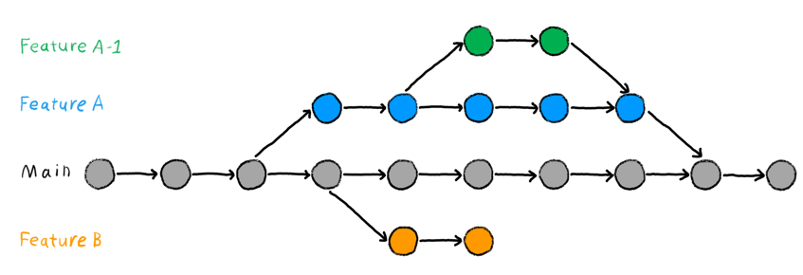
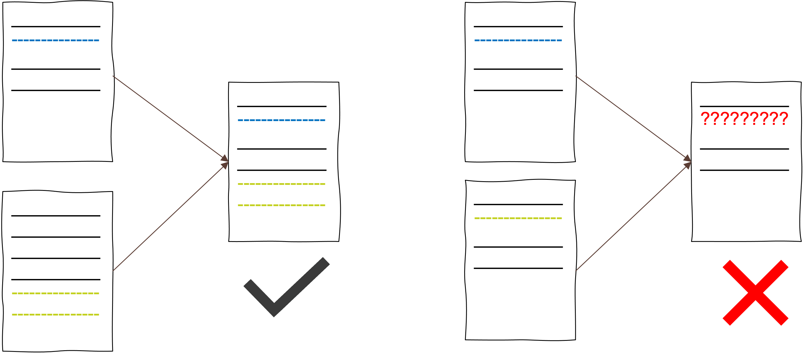
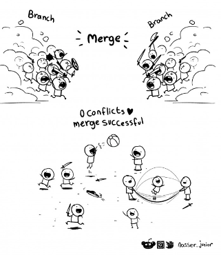

# Branching and Merging

!!! note "Objectives📍"

    - branch
    - checkout
    - merge
    - HEAD and detached HEAD
    - moving in your commit history
    - how to solve a merge conflict

Now that we know how to make,record, and inspect changes with git we want to dive into the really cool features of git. In the introduction we heard something about "multiple streams of work". In git this is done by `branches`. So far we only worked on the `main` branch. This is our main development stream. However, sometimes we want to try something new with our code and see if it works out without trashing our main development stream with too many commits. Or, we work collaboratively and you work on one module of the code and your collaborator works on another module of the code. To not interfere too much and having to incorporate the changes of your collaborator all the time and keep a clean main development stream, you should work on separate branches. In the end, you can `merge` your versions into the main branch. 

<figure markdown="span">
  { width="800" }
  <figcaption>Branching with git. You always start your development on the main branch. Along the way you might want to try out different things while keeping your main development stream clean. For this you can create as many branches as you need, working on them in parallel and incorporate the work you did on these features into the main branch. Or not.</figcaption>
</figure>


Before we try this, we need some more vocabulary:

!!! tip "More Git vocabulary"

    - `git branch`: create a new branch
    - `git checkout`: check out (or “replace”) file in working directory with another staged or committed version AND move between branches
    - `git merge`: to merge two separate sets of version (branches) into one

## Creating a new branch 

Let's say you were asked by our supervisor to set up your experiment with a new feature, e.g., adding some eye tracking in addtion to your EEG experiment. Because want to keep the main development stream clean and we know that we need to work on the eye tracking feature a lot, we decide to set up an extra branch for it. 

!!! question "Task 4"

    1) Create a new branch by typing `git branch eyetrack`. Check with `git branch` if it worked. <br>
    2) Switch to your new `eyetrack` branch by typing `git checkout eyetrack`. You should see *"Switched to branch eyetrack"*. Check if you are really on the new branch. <br>
    3) Make a change to your experiment code, add and commit it. <br>
    4) Do a `git log`. <br>

    What is different about the git log output compared to the last git log we did? <br>

    Why is `HEAD` not with `main`?


!!! tip "git branch"

    - to know which branch we're currently on we can do a `git branch`
    - we can switch between branches by doing `git checkout branchname`
    - instead of `git branch name-of-new-branch` plus `git checkout name-of-new-branch` we could also just do a `git checkout -b name-of-new-branch`


## Moving around in your commit history

`git checkout` is not only for moving between branches, but also to move on one branch between commits. You might want to do this because you realize that you like the instructions for your experiment from a previous version much better and want to bring them back without loosing all the other changes you did on the way. Or, you might want to create a branch not from the last commit but from a way earlier commit.

!!! tip "git checkout"

    - `git checkout` allows you to move around in your commit history and between branches
    - `git checkout HASH` leads you to an earlier version of your project on your **current branch**
    - `git ceckout branchname` leads you to the latest commit made on the branch you've chosen to go to. Every commit you make now will be recorded on the branch you checked out to. To record changes to another branch, you first have to do a `git checkout other-branchname` again
    - checking out to an earlier commit brings you in the so-called *detached HEAD stage*. This means that you are currently not connected to any branch. To make changes on the version you're currently on, you first need to create a new branch, then make the changes. When you made your changes, you can merge the new branch with your `main` branch to incorporate the changes to main 


!!! question "Task 5"

    1) Create a new branch from the `eyetrack` branch make a commit on the new branch.<br>
    2) Switch to the `main` branch and make a commit. <br>
    3) Move to your third commit. Create a branch from this commit. <br>
    4) Switch back to the `main` branch

    ??? tip "Answer"

        1) check with `git branch` if you're currently on the `eyetrack` branch. If not: `git checkout eyetrack`. Make a change. `git add change` & `git commit`.<br>
        2) `git checkout main`. Make a change. `git add change` & `git commit`<br>
        3) `git log` to find hash of third commit. `git checkout hash-of-third-commit`. `git branch new-branch`<br>
        4) `git checkout main`


!!! question "Task 6"

    How does our development stream look like? Draw your commit history with all the branches like in Fig. 13 shown at the top of this page. 

## Merging and merge conflicts

Merging means bringing two independent development streams together. Previously, we said we wanted to add an eye tracking feature to our experiment code. Now that we worked on it a bit we are certain that we can incorporate eye tracking into our experiment. This means, we want to incorporate our work from the `eyetrack` branch into the `main` branch. It will look like this [^1]: 

|||
|:---:|:---:|
| *Independent branches of work.* | *Merged branches.* |

!!! tip "git merge"

    - Merging always refers to two branches
    - with the command `git merge name-of-the-branch`, `name-of-the-branch` will be incorporated into the branch you're currently on
    - especially when you start working collaboratively with git, you will run into `merge conflicts`. This is something common and not a catastrophe. There is a solution to the conflict (see below).


!!! question "Task 7"

    Merge the `eyetrack` branch into the `main` branch. 

    ??? tip "Answer"

        - check if you're currently on the `main` branch. If not: `git checkout main`
        - `git merge eyetrack`

Did you run into a merge conflict? If not, do the optional Task.

??? tip "Optional task to induce a merge conflict"

    1) `git checkout eyetrack`<br>
    2) change something in your code on the eyetrack branch by deleting something in your instructions and writing an alternative text on the **exact same place** as you deleted from. Add and commit. <br>
    3) `git ceckout main` <br>
    4) `git merge eyetrack`

The reason why we run into merge conflicts is because of the way git tracks the changes in our files. Git inspects our project on a file-by-file and line-by-line basis. This is the reason why a `git diff` can give us such detailed information about our changes. However, this also means that when we make changes on the `eyetrack` branch to a line that already exists on the `main` branch and then want to merge, git simply is confused and doesn't know which one of the two versions we want to keep. 



So, git is super nice and asks us which one we want to keep by giving us a notice about a merge conflict. A merge conflict looks like this: 

```
git merge eyetrack
Auto-merging crtt_exp.py
CONFLICT (content): Merge conflict in crtt_exp.py
Automatic merge failed; fix conflicts and then commit the result.
```

As you can see, git tells us in which file the merge conflict appeared and asks us to fix the conflicts. We can fix it by opening the file and modifying it so that only one version stays. 

!!! question "Task 8"

    - open the file in which the merge conflict appeared 
    - at the place where the merge conflict is you will see this:

    > <<<<<<< HEAD<br>
    >this is the content of the file on `main`<br>
    >...<br>
    >=======<br>
    >this is the content of the file on `eyetrack`<br>
    >. >>>>>>> eyetrack<br>

    You can see that git tells you where the merge conflict starts and what the merge conflict is about. Thanks to VSCode you have some buttons where you can click on to choose which of the two versions you want to keep.

    - solve the merge conflict
    - add and commit the file
    - do a `git merge` again
    - Check with the Git-Graph feature of VSCode how your project development looks like

<figure markdown="span">
  { width="400" }
</figure>

Now that we are experts in using git locally on our machine, we're finally ready to start using git collaboratively!!!!

<p align="center"><iframe src="https://giphy.com/embed/fxsqOYnIMEefC" width="480" height="217" frameBorder="0" class="giphy-embed" allowFullScreen></iframe><p><p align="center"><a href="https://giphy.com/gifs/well-done-fxsqOYnIMEefC">via GIPHY</a></p></p></p>

P.S.: check out this [tutorial](https://www.atlassian.com/git/tutorials/advanced-overview) for learning advanced git commands. 

[^1]: Figures retrieved from the [Atlassian tutorial](https://www.atlassian.com/git/tutorials/using-branches/git-merge)