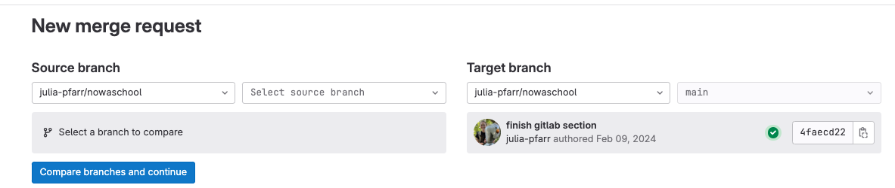

# Contributing and Collaboration on GitLab

!!! note "Objectives📍"

    - fork
    - merge requests
    - gitlab for project management


## Forking and merge requests

Sometimes you want to contribute to a project on gitlab but you don't have write access. This is usually the case if you are not added as a member to the project. Even if the project is public, you cannot contribute to it without opening a `merge request`. The same is true for your own repos: you can make them public, people can `clone` them but they cannot change something on the project without asking you first through a `merge request`. 

**Like mentioned before, even if you are a member of the project and work together with your collaborators, it is always a good idea to work with `merge requests` to foster communication and avoid a ton of conflicts.** We highly advise you to ALWAYS work with branches and merge requests!

To open a `merge request` on a repo where you don't have write access to, you first need to `fork` this project. You'll find the `fork` button on the upper right in the respective gitlab repo. Forking a project means copying a remote repository from another user as a remote repository under your username. 


!!! question "Task 14"

    - Go to [this repo](https://gitlab.com/julia-pfarr/choice_rtt) on GitLab
    - fork the project
    - clone your forked project
    - make a change and push it back to your forked project 
    - open a `merge request` on the original project:
        - go to the [original repo](https://gitlab.com/julia-pfarr/choice_rtt)
        - click on `merge requests` on the left sidebar
        - select your repo and branch as `source branch` and as `target branch` select the original repo and branch 
    - on the original repo you should see a new merge request. Now the owner of the original repo can review it and decide to approve and merge it, or not. 

    This is how your collaborative workflow on GitLab should look like, even if every collaborator has access. 

    


## GitLab for project managing

GitLab is actually more than just a code development platform. It has so many additional functions. Under the section `Plan` you can manage tasks (`issues` and `issue board`), keep track of important `milestones` and assign `issues` to `milestones`. You can write a comprehensive `wiki` to store important information about the project (e.g., links to other important resources such as data repo, document meeting minutes etc.). 

You can also do automated testing of your code (`continuous integration`/`CI`), build packages or container for apps and `deploy` them to e.g., [docker](https://www.docker.com/). 

It allows you to do a bunch of other stuff which is related to project analytics which is mostly used in industry and exceeds the goals of a science project in academia.

## Extra: Git LFS

 *Note: Text and images retrieved from [atlassian.com](https://www.atlassian.com/git/tutorials/git-lfs)*


Git is a distributed version control system, meaning the entire history of the repository is transferred to the client during the cloning process. For projects containing large files, particularly large files that are modified regularly, this initial clone can take a huge amount of time, as every version of every file has to be downloaded by the client. Git LFS (Large File Storage) is a Git extension developed by Atlassian, GitHub, and a few other open source contributors, that reduces the impact of large files in your repository by downloading the relevant versions of them lazily. Specifically, large files are downloaded during the checkout process rather than during cloning or fetching.

Git LFS does this by replacing large files in your repository with tiny pointer files. During normal usage, you'll never see these pointer files as they are handled automatically by Git LFS:

1. When you add a file to your repository, Git LFS replaces its contents with a pointer, and stores the file contents in a local Git LFS cache. 


2. When you push new commits to the server, any Git LFS files referenced by the newly pushed commits are transferred from your local Git LFS cache to the remote Git LFS store tied to your Git repository. 


When you checkout a commit that contains Git LFS pointers, they are replaced with files from your local Git LFS cache, or downloaded from the remote Git LFS store.


Git LFS is seamless: in your working copy you'll only see your actual file content. This means you can use Git LFS without changing your existing Git workflow; you simply git checkout, edit, git add, and git commit as normal. git clone and git pull operations will be significantly faster as you only download the versions of large files referenced by commits that you actually check out, rather than every version of the file that ever existed.

1. Download [git-lfs](https://git-lfs.com/)
2. Check installation: `git lfs --version`
3. Initialize git-lfs once for your username: `git lfs install`

If you do a cat ~/.gitconfig, you should see the following added to your git configuration:


    [filter "lfs"]
        smudge = git-lfs smudge -- %f
        process = git-lfs filter-process
        required = true
        clean = git-lfs clean -- %f

4. On your GitLab repo: got to Settings -> General -> Visibility, project features, permissions -> Enable Git LFS
5. check your `.gitattributes` file. For everything you want to use git-lfs, give it the git-lfs attribute, like so:

```
# Graphics: 
    *.png      filter=lfs diff=lfs merge=lfs -text
    *.jpg      filter=lfs diff=lfs merge=lfs -text
    *.jpeg     filter=lfs diff=lfs merge=lfs -text
``` 


## THE END

## optional/reading/further materials

- YouTube is full of Git/GitLab/GitHub videos for all kinds of levels and features!!! For example: Brainhack [Git introduction](https://youtu.be/fBgxmpk9C4I?si=im33MV2V0PV8uM0k) or [GitHub CI](https://youtu.be/VibDC49ZAJE?si=587WHWe1nZQzHIay)
- Git cheat sheet by [gitlab](https://about.gitlab.com/images/press/git-cheat-sheet.pdf) or [github](https://education.github.com/git-cheat-sheet-education.pdf)
- [Atlassian tutorials](https://www.atlassian.com/git/tutorials) and [cheat sheet](https://www.atlassian.com/git/tutorials/atlassian-git-cheatsheet)
- Troubleshooting: [Oh shit git](https://ohshitgit.com/) or [Dangit git](https://dangitgit.com/) (are the same, but the latter is without swearing)
- [Git branching](https://learngitbranching.js.org/?locale=de_DE)
- [Git GUIs](https://git-scm.com/downloads/guis) 
- [Advanced Git commands](https://www.atlassian.com/git/tutorials/advanced-overview)
- [NOWA workshops](https://sfbs.pages.uni-marburg.de/sfb135/nowa/nowa.site/tutorial/)
- really, just type anything you want to know about Git in YouTube and you'll find a tutorial for it. 