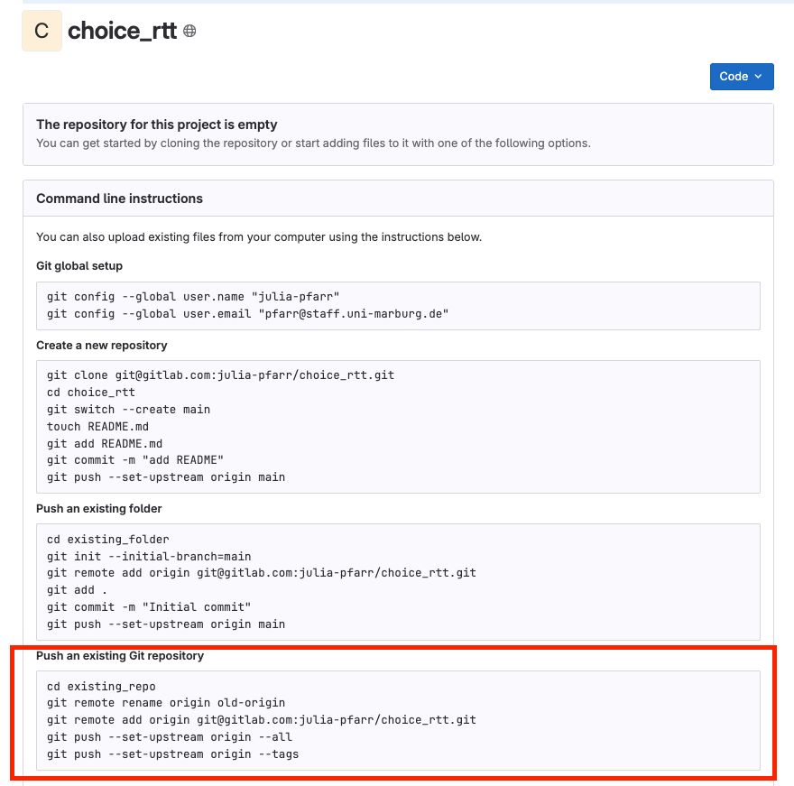
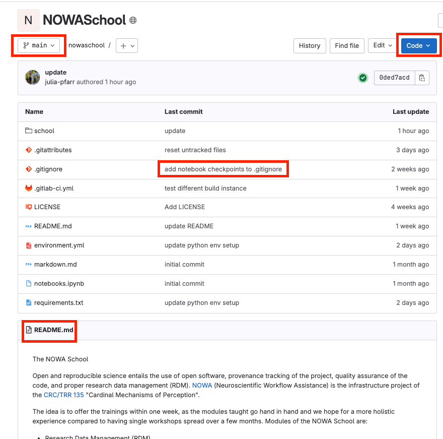
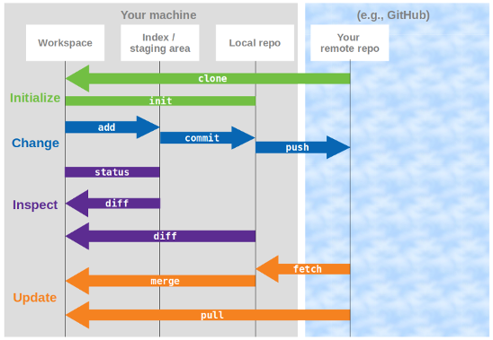

# GitLab

!!! note "Objectives📍"

    - What is GitLab
    - local vs. remote repository
    - push
    - pull
    - clone
    - fetch
    - merge
    - Merge conflict between your local and remote repository

As mentioned in the introduction, GitLab is a platform for collaborative code development. Everything we did so far in this Git course we did on our local machine and nobody has access to our project. Because collaboration is a major part in science, we need to be able to have a centralized workflow without needing to send all of our files back and forth with emails. This is very cumbersome and also no one ever knows what is the current version because between sending an email and actually getting feedback some time will pass. By putting your project on a centralized repository and giving your collaborators access to this repository, they will: 

- always see the latest version of the project
- see the development stream of the project (aka commit history)
- they can retrieve the project and make changes and either commit them directly or ask you if you want to incorporate those changes (`merge request`)
- they can comment on it 
- they can open a discussion (`issue`)
- and much more...you can even do project management on gitlab if you want to

All we have to do is to set up a remote repository on gitlab and synchronize our local work with this remote repository. First we need some more vocabulary:

!!! tip "More Git vocabulary"

    - `git push`: synchronize your local repository with the remote repository by pushing changes in the local repository into the remote repository
    - `git pull`: synchronize your local repository with the remote repository by pulling changes from the remote repository into the local repository
    - `git clone`: this gives you an exact copy of a remote repository on your local computer
    - `git fetch`: fetching the latest version from the remote repository into your staging area

!!! question "Task 9"

    - go to GitLab and log in.
    - click on "new project" --> "create a blank project".
    - give the project the name, preferrably the same name as your local folder has.
    - under "Project URL" select your name.
    - select "public" as visibility level.
    - **uncheck** the box "Initialize with a README".

We are now presented with this page:

This page basically presents you with different options on how to fill your gitlab repository. Because you already have a git repository, namely the Git project on your local machine, we need the last option "Push an existing git repo". 

!!! question "Task 10"

    Follow the instructions given by gitlab for "Push an existing git repo". After you did all of this, refresh the page. 

??? tip "I get an error when I push via ssh"

    First, please check that you followed the GitLab ssh instructions as linked on the [setup page](setup.md). If you did and it doesn't work, it's likely that the ssh connection to gitlab wasn't properly stored in your `.ssh config`. Here's how you can solve this:

    - navigate in the terminal to your `.ssh` folder. It's in your root directory, so `cd ~/.ssh` should work for everyone
    - inside this folder, check if you have `config` file by typing `ls` 
    - if you see a file named `config` in the list open it. If not, create this file. Both can be done by typing `nano config` (if you have nano as a text editor). Other ways can be `touch config` or `vi config`, whichever works for you
    - inside this file you have to write the following (watch the indentation!): 

        Host gitlab.com
        HostName gitlab.com
        IdentityFile ~/.ssh/id_ed25519  # replace id_ed25519 with the name of your own ssh key

    - save and close the file and try `git push --set-upstream origin --all` again 

    If that still doesn't work, you can also chose `HTTPS` instead of ssh. For this I recommend using a `Personal Access Token`. Because if you use https for push/pull/clone etc., you will always be asked for your `username` and `password`. However, if you use a personal access token, you only have to use it once and git will remember it. For creating a personal access token, follow these steps:

    - click on your profile on the upper left and select `Preferences`
    - go to `Access Tokens` on the left sidebar
    - click `add new token`
    - give it a name (e.g., the name of the machine you're currently using, like "julia's macbook"), delete the `expiration date`, and click `api` under `select scopes` 
    - click `create personal access token`
    - copy your token (THIS IS SUPER IMPORTANT! This is the only time you can actually see your token on gitlab, after that it will never be shown to you again, so please make sure to copy and save it somewhere you can find it again!)
    - go to your terminal and type the following one after another:
        - `git remote rename origin old-origin`
        - `git remote add origin https-link-of-your-repo` --> you can find the https link by going to your gitlab repo and clicking on the blue `code` button on the upper right and switch to `https`
        - `git push --set-upstream origin --all`
        - now it will ask username and password. Give your `username` **but instead of the password, put your access token!**

Through the command `git push --set-upstream origin --all` we set up remote branches to track our local branches. The remote branches have the same names as our local branches but have a `origin/...` added. That's how git can distinguish local and remote work.

!!! tip "Local vs. Remote Repository"

    The local and the remote repository are two different things. You need to actively initiate the synchronization between the two (push-pull). 

    One important thing to remember for understanding how the synchronization between git and GitLab works is:git makes you think you work on the same branches locally and remotely: they follow the same working stream and share the same version history, you don't need to switch between branches. But technically it’s handled as if it’s different branches: `main` vs. `origin/main`. This is necessary for the communication between local and remote repository to enable functions like `git merge` and `git diff`. 

Let's take a look at how the main page of a gitlab repository looks like:

- at the top left we can see which branch of the project is currently displayed in the remote repository. When you click on it, you can change the branch and the files shown will automatically update according to the state of the files on this other branch
- on the top right you'll find the code for the repository which you (and others) will need to connect to the gitlab repo, for example for cloning the repository
- the marked part in the middle shows a commit message. Here it becomes evident why you should not just blindly add and commit everything at once. Because here you can see that your commits are bound to your files. If you always do `git add .` and commit, all your files will have the same commit message so the benefit of seeing at first sight what was last changed in this file is lost 
- Lastly, you can see that README files in your repository will always be automatically rendered on the main page of the repo. This is another reason why you should have a nice and informative README file for your project

## GitLab in VSCode

If you work in VSCode, it automatically notices that you have a remote repository involved. When you click on the git graph on the left bar you can see the remote repository under `SOURCE CONTROL REPOSITORIES` and when you click on the arrow next to `commit` you can see that now you also have the option to `commit & push` with one click. Tip: if you install the extension "git graph" you can also see your development stream in VSCode. 

## Working collaboratively

Because gitlab is the best to learn via working collaboratively, this is what we will do!

!!! question "Task 11" 

    - Find a partner (find instructions on how to do this exercise alone below). Choose one of your gitlab repos to be the one you will both work on during the rest of this session.
    - Add the person who is not the owner of the repository as a project member with the role "Developer"

    From now on the owner of the repository is called `owner` and the collaborator is called `developer`.

    - `developer` clones the repository:
        - navigate with the terminal to your desktop 
        - got to the `owners` gitlab repo by searching for their name. Click on the respective repo.
        - click on the `code` button on the upper right
        - copy the "clone via ssh"
        - type in your terminal `git clone repo-link-you-just-copied`

    - `developer` opens a file, makes a change, adds and commits it
    - `developer` pushes the change to the repo by doing `git push repo-link-you-just-copied`
    - `owner` refreshes gitlab repo to see if the change was updated
    - `owner` needs to incorporate the changes from the remote repo into the local repo: `git pull repo-ssh-link`
    - `owner` opens a file, makes a change, adds and commits it
    - `owner`pushes the change to the repo by doing `git push`

??? question "Instructions for doing this exercise alone"

    - create a new folder on your desktop called `developer` and `cd` in it
    - clone your own repository into the `developer` folder:
        - click on the `code` button on the upper right
        - copy the "clone via ssh"
        - type in your terminal `git clone repo-link-you-just-copied`
    - follow the instructions above by switching between the original folder and the cloned repo in the `developer` folder (best is to open to separate VSCode windows to not get too confused)

    For the following tasks, `owner` refers to your "original" folder, and `developer` refers to the new folder that has the clone in it. So, you need to switch between those two folders regularly through changing directories in the terminal. 

??? tip "Project Member Roles and Permissions"

    The list is sorted from all to nothing, meaning the next lower level inherits the restrictions from the higher level.

    - Owner: can do anything that is possible on the repository
    - Maintainer: can't delete anything; can't assign, archive, transfer project or change visibility level
    - Developer: + can't manage gitlab pages; can't change container registry and application security
    - Reporter: + can't manage incidents
    - Guest (This role applies to private and internal projects only.): + can't manage issues, merge requests; has almost no project management permissions

!!! tip "git clone" 

    - if you clone a repository it will only clone main 
    - to get the other branches of the remote repo:
        - `git branch –a`  shows you all available branches (e.g., origin/eyetrack)
        - `git checkout eyetrack`: creating a local Branch and git automatically detects that there is a remote sibling branch
        - git output: branch ‘Party2' set up to track 'origin/eyetrack’
        - repeat for every branch you want to have locally available

!!! tip "git pull" 

    `git pull` means you are pulling the version from the remote origin branch directly into your working directory which also means an automatic merge of remote and local branch. It therefore updates your git repo AND your working directory in one command.

!!! tip "git fetch"

    - `git fetch` means that git is updating the remote branch in your local git repo called `origin/main` where it contains the latest *remote version* of the project. It is not updating your local branch `main`. 
    - that’s why you have to (or can) merge: your corresponding local branch `main` in your working directory contains a different version of the project than the remote branch `origin/main`
    - that’s also the reason why you can do git diff: it compares our `main` branch in the working directory with the `origin/main` branch in the git repo
    - `git fetch` is helpful if you want to inspect the changes from the remote repository first before incorporating them locally. Because maybe a merge conflict is hiding in the remote version 

## Summary gitlab workflow

[^1]

### Merge conflict between local and remote repository

Like mentioned previously, merge conflicts are not unusual and happen more often when you work collaboratively. It is very likely that your collaborator works on the project at the same time as you and sometimes those changes overlap. This is why we want to practice how to solve a merge conflict with the remote repository.

!!! question "Task 12"

    - work with your partner from the previous task again (when alone: your `developer` folder is your partner, still)
    - `developer` does a `git pull`
    - `developer` and `owner` both make a change to the project at the same spot, e.g., modify the same line in the instructions
    - `developer` does a `git push` first
    - then `owner` does a `git push`
    - `owner` should get a message saying:

    > rejected! error: failed to push some refs to 'repo url' 
    > hint: Updates were rejected because the remote contains work that you do not have locally. This is usually caused by another repository pushing to the same ref. You may want to first integrate the remote changes (e.g., 'git pull ...') before pushing again. 

**This error message is not due to the merge conflict but due to the fact that `owner` made one more commit to the commit history and therefore expanded the commit history.** As you both work on the same branch and git works in a linear way, git cannot put two commits at the same place but only one after another. Git expects you to have the latest version with all commits before you make another one. So, you will also receive this message when you don't have a merge conflict but simply didn't pull the latest version first.  

!!! question "Task 13"

    - work with your partner/ developer folder from the previous task again
    - `owner` does a `git pull`
    - `owner` should get a merge conflict message like the one we saw before
    - `owner` needs to resolve merge conflict (we learned how to do that already, yeah!)
    - `owner` can now do a `git push`

??? tip "Tips for working collaboratively with git"

    - make use of `branches`. Sometimes weird things happen when everyone is committing to the main branch all the time. Just create a branch for your own work and `merge` the updates from `main` into your branch regularly
    - make use of `merge requests` (we will learn this in the next section). This way you can incorporate a second communication channel with your collaborators and give them a chance to not only inspect but also discuss the changes before merging them into the `main` branch
    - before you start your work at the beginning of your day, do a `git fetch`, inspect the changes, and `merge` them

[^1]: Image by Peer Herholz

