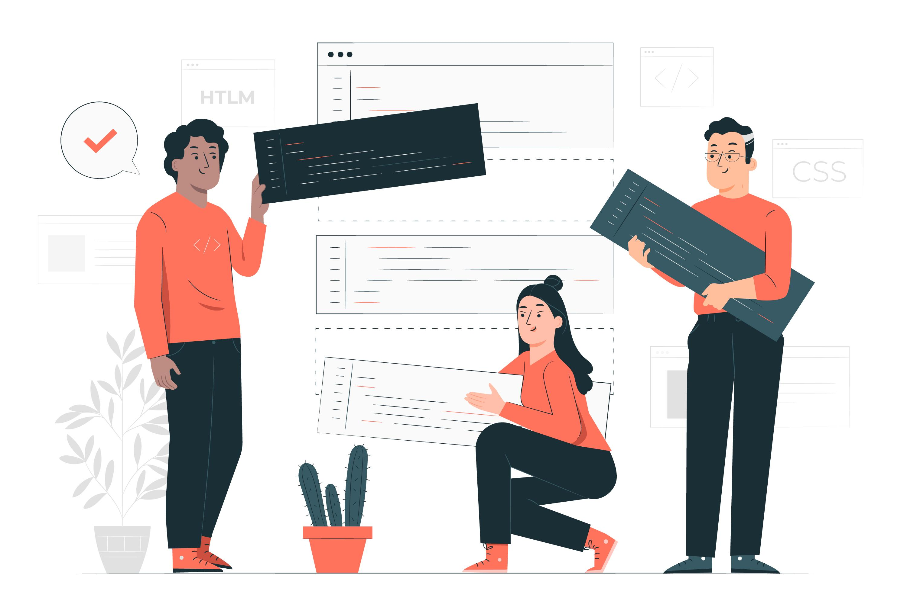
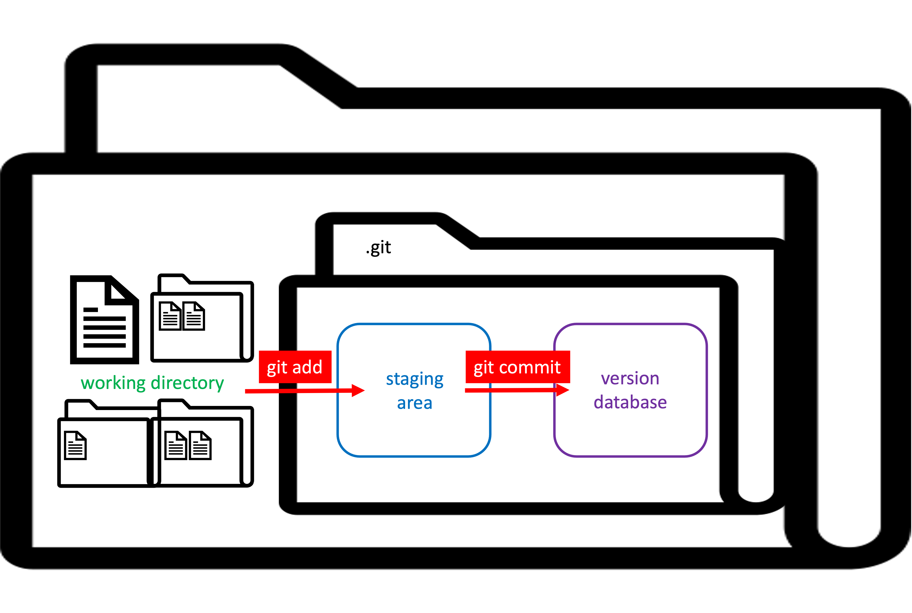

# Introduction

### Where Version Control Comes from

Version Control originally comes from software development. Of course, we develop software, too, like our experiment or data analysis code. However, we often do not develop our code in a team with hundreds of people. When developing an app like a very simple gaming app, a lot of people are involved in active development at the same time. Also, a source code for a very simple gaming app has at least 50,000 rows of code. The code for analysing our research data likely has a lot less rows. The code for the gaming app also has different components (*modules*) and therefore the usual development process is divided in those modules, meaning that one person is responsible for one module. In the end, those modules have to come together smoothly. Also, apps usually come in different versions. We all heard about alpha-, beta-, or release-version of apps. 

So professional software developers were confronted with several challenges: 

- Keep track of what each person is changing in the code
- incorporate changes without breaking another module
- have multiple streams of work for different versions
- etc.

Sometimes Git might work in a way that is a bit too divided for your way of working (i.e., going in small-sized steps). There might be steps in the Git workflow that you consider unnecessary for your own needs. Then it always helps to remember where version control comes from to understand why the version control system is working in the way it does. 

<iframe src="https://giphy.com/embed/O1oJ840fg6uOVCqdzJ" width="240" height="200" frameBorder="0" class="giphy-embed" allowFullScreen></iframe>

<a href="https://giphy.com/gifs/theoffice-the-office-tv-casino-night-O1oJ840fg6uOVCqdzJ">via GIPHY</a>

### Centralization

Another key challenge in software development is facilitating collaborative code development independent of time and space, i.e., centralization. With Git, you are only provided with local version control, meaning it is a software that runs on your computer and no one else has access to your work (=decentralized). For collaborative code development it is necessary that all developers have access to the same project and are able to see all of the projects changes and history (=centralized). 

| | | |
|--- | --- |---|
| *Collaborative code development dependent on time and space*| → |*Collaborative code development independent from time and space*[^2]|

For this, collaborative coding platforms such as GitHub or GitLab are key. This is also a common misconception of Git: **Git is NOT the same as GitHub/GitLab**. They're independent of each other, in principle. You can use Git on your local without using GitHub/GitLab, and you can use GitHub/GitLab without using Git on your local machine. However, the combination of Git and GitHub/GitLab will give you the best of both worlds: Being able to track everything your doing on your local machine even if you don't have internet access as well as sharing everything you did with your collaborators with just one command. 

<iframe src="https://giphy.com/embed/1FqcaGWZaKpva" width="240" height="135" frameBorder="0" class="giphy-embed" allowFullScreen></iframe>

<a href="https://giphy.com/gifs/the-office-steve-carell-michael-scott-1FqcaGWZaKpva">via GIPHY</a>

|**Git** | **GitHub/GitLab** | 
|--- | --- |
| - git is a software on your computer | - collaboration platforms based on the git software |
| - decentralized | - centralized |
| - local version control | - distributed version control |

### Benefits of Version Control 

- Traceability
    - Track changes
    - Annotate each change with a message (=explain what and why) = a complete annotated history of the code
- multiple streams of work (or version sets) independent from each other while also being able to merge the work back together
- For collaborative work this means:
    - keeps all team members on the same page 
    - makes sure that all team members can work simultaneously on the same project 
    - makes sure that everybody is working on the latest version of the project

### The basic principle of Git

As a version control system, what Git does is simply store different version of your project for you. Git itself is a software that provides you with a server database in which the different versions of your project will be stored. All of these versions can be looked at and retrieved at any time, using the appropriate commands. So, what it is important for working with Git is to know how to communicate with it, i.e., knowing the language of Git (which we will learn during this course!). 

<figure markdown="span">
  { width="600" }
  <figcaption>The basic principle of Git. Local folder vs. git version database.</figcaption>
</figure>

#### How the versioning works

>"Ok, so how exactly does Git store different versions of my project?" 

Well, every time you want to save the current state of your project (=*one version*), git takes a "snapshot" of how your folder currently looks like (=*commit* a version). The reference to this snapshot (=*commit hash*) will then be saved in your *commit history* and with this commit hash you can find this version in your version database aka *git repository*. Committing a version means saving a snapshot of how *all* your files currently look like. 

!!! tip "Hello git, please save the current state of the project"

    - making a commit = git's taking a snapshot of the current stage of your project and saving it in the git repository
    - commits are stand alone versions of the project
    - for every commit, git creates a hash which looks like this: 7c35a3ce607a14953f070f0f83b5d74c2296ef93
    - all hashes can be found in the commit history and can be used to look at or retrieve an earlier version 

>"Where is this version database?"

When you ask Git to version control your files (=*initialize Git*), it will create a hidden folder inside your local folder. This hidden folder (called *.git*) is your version database. 

<figure markdown="span">
  { width="400" }
  <figcaption>After initializing Git in your project folder, a hidden .git folder is placed inside your project folder. Inside this hidden .git folder the different versions of the project are stored. </figcaption>
</figure>

>"What does "different versions" of my project even mean? How do I know when to commit a version and when not?"

First of all: The expression "comitting a version" actually should be "comitting changes". Because that's what you do: You start with a first version of your project and time after time you *change* things compared to previous versions. So, what you commit in the end are actually the changes to the project.

Second: For the decision on when to make a commit, it is important to know that every time you make a commit you're being asked to write a short description of what this commit is about (=*commit message*). So, what you should ask yourself before making a commit is: "Is the *change* between my current version compared to the previous version worth being saved as a stand alone version of my project?". 

The commit message you give is bound to your commit, i.e., the commit message should state what you *changed*. Only then you will be able to figure out to which commit you need to go back if you're looking for a specific version of your project.

Another practice about commits is to commit changes that belong together. Namely, if you changed something in file1 and something in file2 and those changes are logically related, you should commit them together. If changes you made are not logically related, you should commit them separately. 

!!! tip "Example for logically related changes"

    You are working on a project where you have to conduct an experiment, analyse the data, and publish a manuscript. You make a change to your stimuli-coding-file by coding a new stimuli shape. You insert this new stimuli shape in your experiment code as well. The changes happened in different files, yet the changes are logically related (make new shape - use new shape). You should commit those changes together, meaning *after* you changed both files. 

!!! tip "Example for NOT logically related changes"

    You are working on a project where you have to conduct an experiment, analyse the data, and publish a manuscript. You make a change to your stimuli-coding-file by coding a new stimuli shape. On the same day, you also make a change in our manuscript (which is awesome, btw), changing the affiliation of one of the co-authors. Those changes are not logically related. You should not put them in the same commit. 

#### The staging area

>"But what if I worked on multiple different things since the last committed version and now I'm ready to commit my changes? Will I not have to commit all files together then?"

Luckily, no! Git has something called *the staging area* which solves this problem. *Staging* your files is basically giving your files a valid ticket for a ride to the version database. Only the files with a valid ticket for the next train (= the files you *staged*) can get onto the this train and take a ride to the version database (= commit to the version database). Every other file is left behind. 

In the end, the basic Git workflow looks like this:

<figure markdown="span">
  { width="600" }
  <figcaption>Basic git workflow. Every change you want to commit needs to be staged first. Only staged changes will be committed in a new version.  </figcaption>
</figure>

My staged changes being excited to take the train to version database:

<iframe src="https://giphy.com/embed/2Qi8IE4VHDGRG" width="480" height="268" frameBorder="0" class="giphy-embed" allowFullScreen></iframe>

<a href="https://giphy.com/gifs/diannamcd-cute-adorable-train-2Qi8IE4VHDGRG">via GIPHY</a>

My staged changes showing commitment and getting on board:

<iframe src="https://giphy.com/embed/5YS2veXdeDhsI" width="480" height="368" frameBorder="0" class="giphy-embed" allowFullScreen></iframe>

<a href="https://giphy.com/gifs/people-help-5YS2veXdeDhsI">via GIPHY</a>

My unstaged changes watching the staged changes take off: 

<iframe src="https://giphy.com/embed/3otPoT6i8x6zNt4ry8" width="480" height="260" frameBorder="0" class="giphy-embed" allowFullScreen></iframe>

<a href="https://giphy.com/gifs/filmeditor-subway-sacha-baron-cohen-3otPoT6i8x6zNt4ry8">via GIPHY</a>

My committed changes arriving at version database:

<iframe src="https://giphy.com/embed/l0IympF29EYGW7K8M" width="480" height="290" frameBorder="0" class="giphy-embed" allowFullScreen></iframe>

<a href="https://giphy.com/gifs/stubru-confetti-studio-brussel-l0IympF29EYGW7K8M">via GIPHY</a>

[^1]: Text generated with ChatGPT. 
[^2]: Figures retrieved from [Freepik](https://www.freepik.com/).